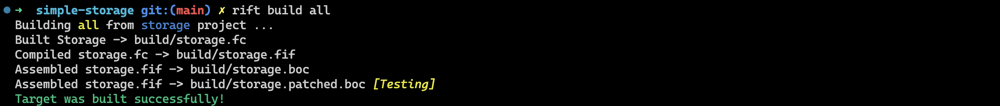
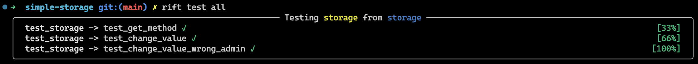
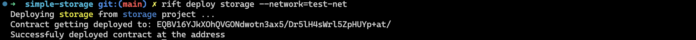

# Step-by-Step with Rift: Simple Storage Contract Tutorial

In this tutorial, we will develop a simple storage contract that can be updated by an admin and can be used to retrieve information. This is the first tutorial in the ***Step-by-Step with Rift*** series, where we will discuss the basic primitives in Rift.

## Getting Started
### Install Rift
Before we begin, make sure you have a `Python 3.10+` environment installed. You can then install Rift using the following command:
```bash
pip install rift-framework
```
### Initialize Project
Next, open up a terminal and run the following command to generate a bare project:
```bash
rift init simple-storage --base=bare
```
The `--base` option specifies the project template used to initialize with. You should see a message similar to the following:
```bash
➜  Skyring rift init simple-storage --base=bare
Initializing new rift project ...
Getting template bare from https://github.com/sky-ring/rift-bare-template
Successfully created project!
```

## Project structure
After initializing the project, you can open the folder with your favorite editor or IDE. If you don't have one, we recommend using VSCode. You can see the directory structure of the project as follows:

```bash
simple-storage
├── README.md # General Readme
├── contracts
│   └── bare_template.py
├── deployers
│   ├── __init__.py
│   └── deploy_base.py
├── project.toml # Project Configuration
├── pyproject.toml # Python Project Configuration - No Edits Necessary
├── tests
│   ├── __init__.py
│   └── test_example.py
└── tox.ini # Python Code Formatter Configuration
```
### Project Configuration
The project configuration is present in the `project.toml` file. You will need to make changes to this file to define new targets, add test and deploy scripts, or configure `rift`'s settings. The contents of this file are as follows:

```toml
# rift project configuration file

name = "bare-template"

[contracts.bare_template]
    name = "bare-template" # This is the generated target name -> [name].fc
    contract = "BaseContract" # This is the contract class you have in the file
    deploy = "deploy_base" # This is name of the deploy script
    # All test scripts should be mentioned here
    tests = [
        "test_example"
    ]
```

### Contracts
All your contracts will reside in the `contracts/` directory. They are defined as classes that inherit the base `Contract` class. Contract codes are executed, and the execution graph is traced and gets translated to `FunC` (and `TVM` in the future). So if you use untraceable operations, the result will be recorded. For more specific details, visit [here](https://docs.skyring.io/rift/).


### Tests
You can define test scripts in the `tests/` directory. Don't forget to mention the test script in your target configuration. Test scripts are simple Python scripts; you can import contracts from the contracts package and use arbitrary Python code.

### Deployers
You can define deploy scripts under the `deployers` directory. This script will be mentioned in target configuration and will run whenever `rift deploy [TARGET]` is executed.

## Storage Contract

### 0. Specifications
In this section, we will develop a storage contract that stores an unsigned 64-bit integer `value` in its storage. The contract will have the following features:

- The contract's `admin` can change this value by sending an internal message.
- The data should be available with a get-method.


### 1. Configure the project
Let's start by refactoring the existing files. We will rename `contracts/bare_template.py` to `contracts/storage.py` and update its content to the following:


```python
from rift import *


class Storage(Contract):
    def internal_receive(self) -> None:
        pass
```

We will also update the project configuration in `project.toml` to the following:

```toml
# rift project configuration file

name = "storage"

[contracts.storage]
    contract = "Storage"
    deploy = "deploy_storage" # Will create later
    tests = [
        "test_storage" # Will create later
    ]

```
### 2. Define the Contract Data
Next, we will define the contract data scheme by adding the `Data` class under our `Storage` class, which will extend `Model`:

```python
# ...
class Storage(Contract):
    class Data(Model):
        admin: MsgAddress
        value: uint64
    # ...
```

### 3. Define contract message structure
We will also specify the contract message body structure as a `Payload` class:

```python
class ChangeBody(Payload):
    new_value: uint64
```

### 4. Implement the `change` Function
The contract's `internal_receive` function will check whether the sender is `admin` and replace the data with the new value. We can access the full message via `self.message` and the message body with `self.body`:

```python
    # ...
    def internal_receive(self) -> None:
        assert self.message.info.src.is_equal(self.data.admin), 1001
        body = (
            self.body % self.ChangeBody
        )  # This parses body as ChangeBody class
        self.data.value = body.new_value
        self.data.save()
```

### 5. Specify the get-method
We need to define a get-method so that the value will be exposed. To do this, we have two options:

1. Add a config docstring to the class so that it's automatically handled during compile time:
```python
    class Storage(Contract):
        """
        Simple Storage Contract.
    ​
        # config
        get-methods:
            - value
        """
        # ...
```
This approach is best when we want to expose a field in our data and don't need any processing. For other use cases, we should define a get-method using the second approach.

2. Define a new method in the contract with `@method_id()` annotation:
```python
        # ...
        @method_id()
        @method()
        def get_value(self) -> uint64:
            return self.data.value
```

### 6. Compiling
Our contract is complete! You can see the full implementation in this file. Let's compile it using the following command:

```bash
rift build all
```
The built files will be available in the `build/` directory.



## Testing
One of the most critical aspects of contract development is ensuring correctness and security. Even minor bugs can result in significant financial losses for contract parties. Properly testing contracts with appropriate test cases is, therefore, an essential step in the development process. Fortunately, Rift includes a built-in testing framework that minimizes the hassle of testing.

To begin, let's rename the `tests/test_example.py` file to `tests/test_storage.py` and use the initial code provided:

```python
from rift import *
from contracts.bare_template import BaseContract


def test_example():
    data = Cell()
    wallet = BaseContract.instantiate(data)
    res = wallet.recv_internal(0, 0, Cell(), Cell().parse())
    res.expect_ok()
```
In the test environment, we can easily import the target contract and instantiate it with an arbitrary cell as its data. We can then call its methods and analyze the results.

First, we'll proceed with testing our `get_value` method to ensure it can properly read from our data cell:

```python
def test_get_method():
    data = Storage.Data(admin=MsgAddress.std(0, 1), value=1).as_cell()
    storage = Storage.instantiate(data)
    res = storage.get_value()
    res.expect_ok()
    (value,) = res.result.stack
    assert value == 1
```
Then, we'll test the `internal_receive` method with a `change_value` call:

```python
def test_change_value():
    data = Storage.Data(admin=MsgAddress.std(0, 1), value=1).as_cell()
    storage = Storage.instantiate(data)
    body = Storage.ChangeBody(new_value=2)
    msg = InternalMessage[Storage.ChangeBody].build(
        src=MsgAddress.std(0, 1),
        dest=MsgAddress.std(0, 0),
        body=body,
    )
    res = storage.recv_internal(0, 0, msg.as_cell(), body.as_cell().parse())
    res = storage.get_value()
    res.expect_ok()
    (value,) = res.result.stack
    assert value == 2
```

We can also test that the contract disallows unauthorized changes by testing with another admin:

```python
def test_change_value_wrong_admin():
    data = Storage.Data(admin=MsgAddress.std(0, 1), value=1).as_cell()
    storage = Storage.instantiate(data)
    body = Storage.ChangeBody(new_value=2)
    msg = InternalMessage[Storage.ChangeBody].build(
        src=MsgAddress.std(0, 2),
        dest=MsgAddress.std(0, 0),
        body=body,
    )
    res = storage.recv_internal(0, 0, msg.as_cell(), body.as_cell().parse())
    res.expect_exit(1001)
```

To run the test command, enter the following in the command line:  

```bash
rift test all
```

The expected output is:


## Deploying
The first step is to define the `deploy` function in `deployers/deploy_storage.py`. The `deploy` function deploys the contract to the blockchain and returns a message and a boolean flag. The message carries the contract deploy code and initial data, and the boolean flag indicates whether this message will be sent independently or through your wallet as an internal message. In our case, the flag is set to `False` because we are sending the message through our wallet as an internal message. Here is the initial template code:

```python
from rift import *

# You can import from contracts here
from contracts.bare_template import BaseContract


def deploy(network: Network):
    init_data = Cell()
    msg, addr = BaseContract.deploy(init_data, amount=2 * 10 ** 8)
    return msg, False
```

When you execute `rift deploy TARGET`, Rift executes the deploy function and sends the given message to the blockchain.


Now we need to construct the initial data for our contract and deploy it. We'll modify the `deploy` function as follows:

```python
def deploy(network: Network):
    # Get our wallet and it's address
    wallet = WalletManager.acquire_wallet(network)
    my_addr = wallet.calculate_address()
    # Create initial data for contract
    init_data = Storage.Data(admin=my_addr, value=0).as_cell()
    # Create a change body as the first message to the contract
    body = Storage.ChangeBody(new_value=1)
    # Send the deploy request bearing 0.1 TON for fees
    msg, addr = Storage.deploy(init_data, amount=10**8, body=body.as_cell())
    print("Contract getting deployed to:", MsgAddress.human_readable(addr))
    return msg, False
```
In this modified `deploy` function, we first get our wallet and its address. Then, we create the initial data for the contract, which includes the admin address and an initial value of 0. Next, we create a change body as the first message to the contract, setting the new value to 1. Finally, we send the deploy request bearing 0.1 TON for fees.

To deploy the contract on testnet, run the following command:
```bash
rift deploy storage --network=test-net
```
On the first try, you will need to configure/create a wallet with Rift and fund it. After executing the command, you should see a message indicating that the contract is getting deployed to a specific address.


## The End
This tutorial has demonstrated the step-by-step process of developing and deploying a simple storage contract on testnet using Rift. This will serve as a basis for further development guides with Rift. You can find the full project implementation [*here*](https://github.com/sky-ring/simple-storage). If you want to stay updated, join our [***community channel***](https://t.me/skyring_org). We prioritize simple step-by-step guides and are continuously updating our documentation. Stay tuned!
This tutorial has demonstrated the step-by-step process of developing and deploying a simple storage contract on testnet using Rift. This will serve as a basis for further development guides with Rift. If you want to stay updated, join our community channel. We prioritize simple step-by-step guides and are continuously updating our documentation. Stay tuned!